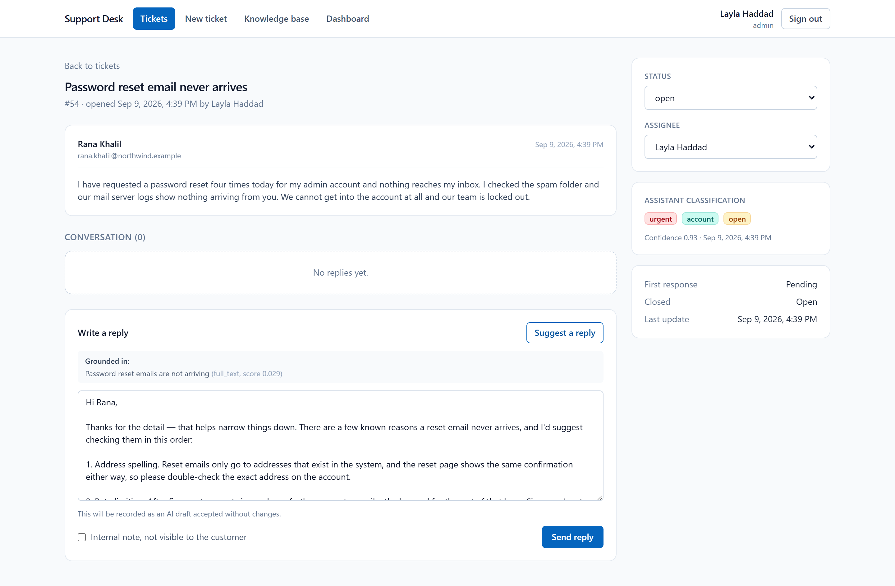
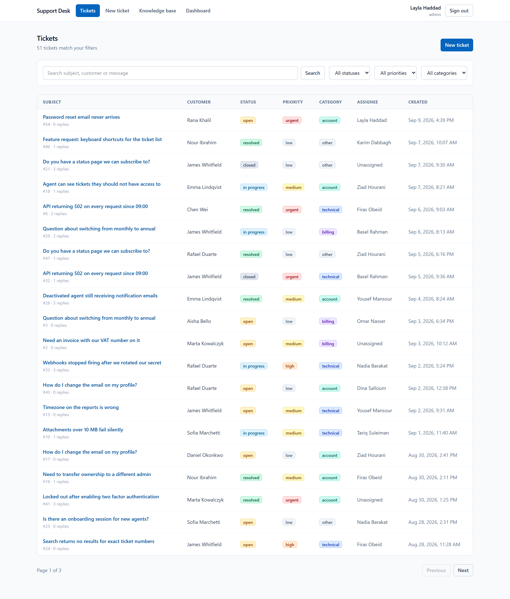
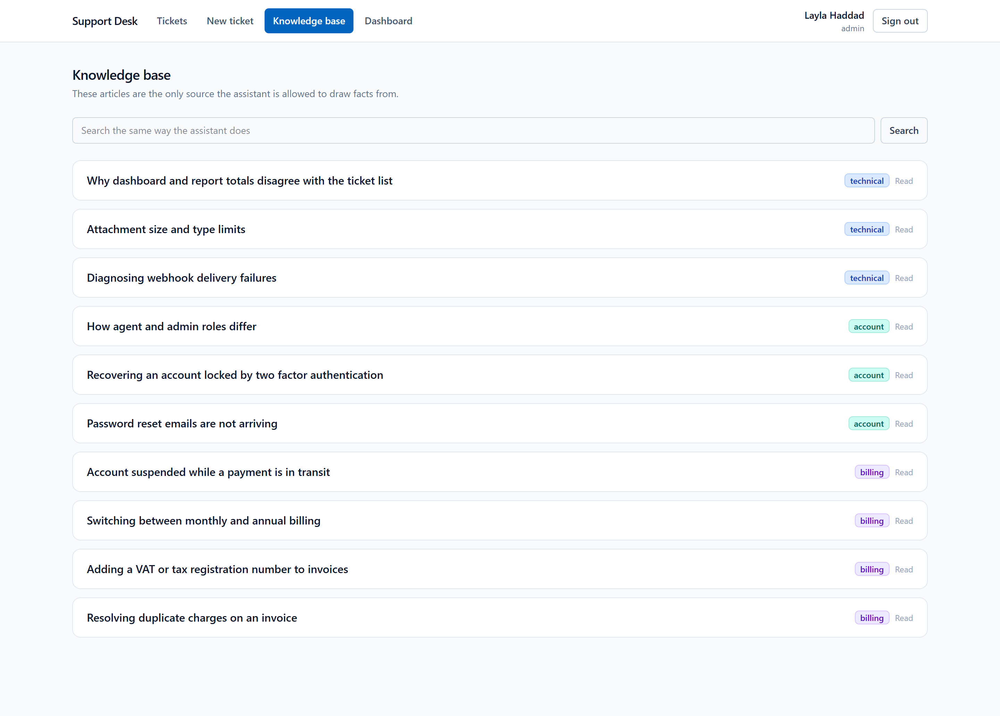
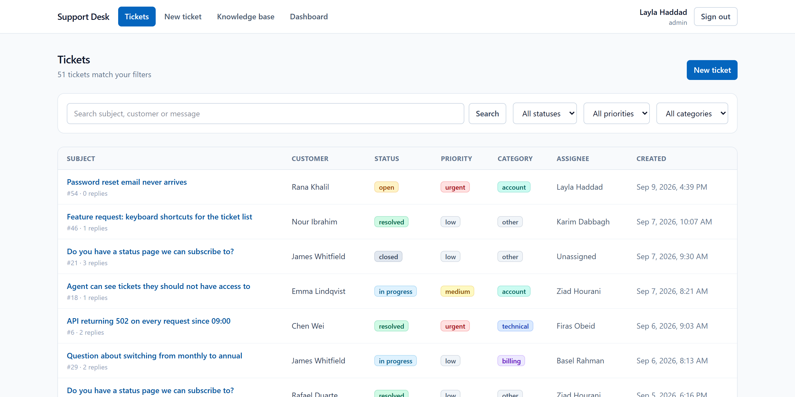

# AI Support Ticket System

[](LICENSE)
[](https://nodejs.org/)
[](https://www.postgresql.org/)
[](https://react.dev/)
[](https://www.anthropic.com/)
[](https://github.com/MohammedBDE/SupportHub-AI)

A support desk where the assistant reads every incoming ticket, classifies it, retrieves the relevant
internal documentation, and drafts a grounded reply that a human agent edits before sending.

Built with Node.js, PostgreSQL, React, and the Claude API.

---

## The problem

A support agent spends most of a ticket's life on work that is not the actual answer:

1. Reading the message to decide what it is about and how urgent it is.
2. Hunting through internal documentation for the relevant procedure.
3. Rewriting the same explanation they wrote last week.

This system removes all three, without removing the human from the loop.

## What it does

```
Customer message arrives
        │
        ▼
Agent logs the ticket
        │
        ▼
Claude classifies it            →  category + priority + confidence
        │                          (rejected by the database if the value is invalid)
        ▼
Agent clicks "Suggest a reply"
        │
        ▼
Retrieval finds the 3 most relevant knowledge base articles
        │
        ▼
Claude drafts a reply grounded ONLY in those articles
        │
        ▼
Agent edits and sends
        │
        ▼
System records whether the draft was sent unchanged   →  dashboard metric
```

## Screenshots

**Ticket detail — the assistant's classification, the retrieved source, and the drafted reply.**
The draft is grounded in one knowledge base article, named under "Grounded in", and the form warns
that sending it unchanged will be recorded as such.



**Ticket list — filters, search, pagination, and the classification the assistant assigned.**



**Dashboard — response times and the AI acceptance rate that says whether the assistant earns its cost.**


<details>
<summary>Knowledge base and sign in</summary>





</details>

---

## Architecture

```
┌──────────────────────────────────────────────────────────────┐
│  React SPA (Vite + Tailwind)                                 │
│  login · ticket list · ticket detail · knowledge base · dash │
└───────────────────────────┬──────────────────────────────────┘
                            │  fetch, Bearer JWT
┌───────────────────────────▼──────────────────────────────────┐
│  Express API                                                 │
│                                                              │
│  middleware/   authenticate (JWT) → authorize (role)         │
│  routes/       auth · tickets · knowledge-base · analytics   │
│  services/     ticketClassifier · knowledgeSearch            │
│                replySuggester · embeddingProvider            │
└──────────┬──────────────────────────────┬────────────────────┘
           │                              │
┌──────────▼─────────────┐   ┌────────────▼───────────────────┐
│  PostgreSQL            │   │  Claude API                    │
│  users · tickets       │   │  classification (json_schema)  │
│  replies               │   │  reply drafting (json_schema)  │
│  knowledge_base        │   └────────────────────────────────┘
│    + tsvector (GIN)    │
│    + vector (optional) │
└────────────────────────┘
```

### Data model

```
users ──1:N──> tickets ──1:N──> replies
  │              ▲                 │
  │              │                 │
  └── created_by / assigned_to ────┘ author_id

knowledge_base            (no foreign key to tickets on purpose:
                           the relationship is discovered by search
                           at query time, not stored)
```

---

## Running it

### With Docker (one command)

```bash
cp .env.example .env
```

Set `DB_PASSWORD` and `JWT_SECRET` in `.env`, then:

```bash
docker compose up --build
```

The app is on http://localhost:8080. Seed it with demo data:

```bash
docker compose exec backend node src/db/seed.js --reset
```

### Without Docker

```bash
createdb support_tickets
psql -d support_tickets -f backend/src/db/schema.sql
```

```bash
cd backend && npm install && cp ../.env.example .env
```

Edit `backend/.env`, then:

```bash
cd backend && node --env-file=.env src/db/seed.js --reset && npm run dev
```

```bash
cd frontend && npm install && npm run dev
```

### Demo accounts

After seeding:

| Role  | Email                             | Password              |
| ----- | --------------------------------- | ---------------------- |
| admin | `layla.haddad@supporthub.io`      | `admin-password-2026` |
| agent | `omar.nasser@supporthub.io`       | `agent-password-2026` |

The app runs without an `ANTHROPIC_API_KEY`. Classification and reply drafting are simply disabled and
reported as unavailable; everything else works.

---

## API

| Method | Path                        | Who        | Purpose                                  |
| ------ | --------------------------- | ---------- | ----------------------------------------- |
| POST   | `/auth/login`               | public     | Exchange credentials for a JWT           |
| GET    | `/auth/me`                  | any staff  | Current user from the token              |
| POST   | `/auth/register`            | admin      | Create a staff account                   |
| GET    | `/auth/users`               | admin      | List staff                               |
| POST   | `/tickets`                  | any staff  | Create a ticket, then classify it        |
| GET    | `/tickets`                  | any staff  | List with filters, search, pagination    |
| GET    | `/tickets/:id`              | any staff  | One ticket plus its replies              |
| PATCH  | `/tickets/:id/status`       | any staff  | Change status                            |
| PATCH  | `/tickets/:id/assign`       | admin      | Assign or unassign                       |
| POST   | `/tickets/:id/suggest-reply`| any staff  | Retrieve articles, draft a grounded reply|
| POST   | `/tickets/:id/replies`      | any staff  | Save a reply, record AI provenance       |
| GET    | `/knowledge-base`           | any staff  | List or search articles                  |
| POST   | `/knowledge-base`           | admin      | Create an article, embed it              |
| GET    | `/analytics`                | admin      | Dashboard aggregates                     |

Agents see only tickets they created or that are assigned to them. That filter is applied inside the
SQL query, not after fetching, so a ticket an agent cannot see returns 404 rather than 403 — the
system does not confirm that the ticket exists.

---

## Key technical decisions

**Replies are a table, not a column.** One ticket has an unknown number of replies, each with its own
author, timestamp, and AI provenance. A text column cannot hold any of that, and appending to one is a
read-modify-write that silently loses concurrent replies.

**Invalid AI output is rejected by the database.** `category` and `priority` carry `CHECK` constraints
listing the allowed values. If the model returns something outside the list, the write fails. The
service layer validates too, but the constraint is the guarantee that does not depend on application
code being correct.

**Two hallucination guards on the reply drafter.** The system prompt forbids facts outside the
retrieved articles and requires the model to declare which article ids it used. The server then
intersects those ids with the ones it actually supplied, so a reply citing an article that was never
retrieved is reported as ungrounded in the UI.

**`ai_suggestion_text` is stored next to the sent reply.** Without the original draft there is no way
to measure the acceptance rate, which is the metric that says whether the AI is worth its cost.

**Retrieval degrades instead of failing.** With `VOYAGE_API_KEY` set, search uses pgvector cosine
similarity. Without it, search uses PostgreSQL full-text search over a generated `tsvector` column.
Both paths return the same shape, and the UI shows which one produced each result.

**JWT carries the role.** Authorization checks need no database round trip, at the cost of a stale
role for up to one token lifetime (one hour). Acceptable for an internal tool; a token deny-list would
be needed for anything customer-facing.

**Passwords use bcrypt with 12 rounds**, and login compares against a placeholder hash when the email
does not exist, so response time does not reveal which addresses are registered.


---

## Current limitations

These are known and deliberate, not oversights:

- **No token revocation.** Signing out clears the token client-side, but the token stays valid until it
  expires. Refresh tokens plus a deny-list would fix this.
- **The JWT is in `localStorage`**, so any XSS becomes a session takeover. An httpOnly cookie plus CSRF
  protection is the stronger design; `localStorage` was chosen to keep the auth flow readable.
- **Classification is synchronous.** Creating a ticket waits for the model, so the request takes a few
  seconds. A queue with a background worker is the right answer at real volume.
- **No automated tests.** The project was built to be understood step by step; a test suite is the
  natural next phase.
- **Retrieval is article-level.** Long articles are embedded whole, which dilutes the vector. Chunking
  would improve recall on a larger knowledge base.
- **Rate limiting is missing** on `/auth/login`, which leaves it open to online password guessing.
- **The "sent unchanged" metric is exact-match**, so a one-character edit counts as a full rewrite.
